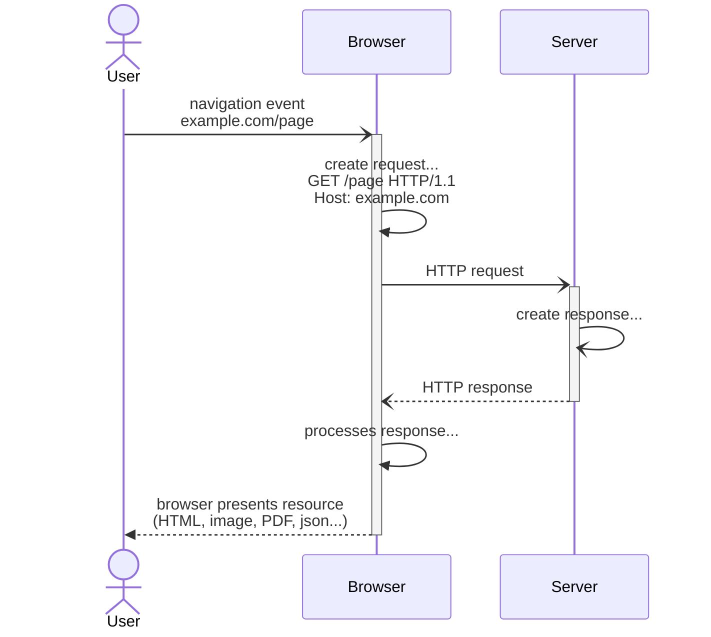
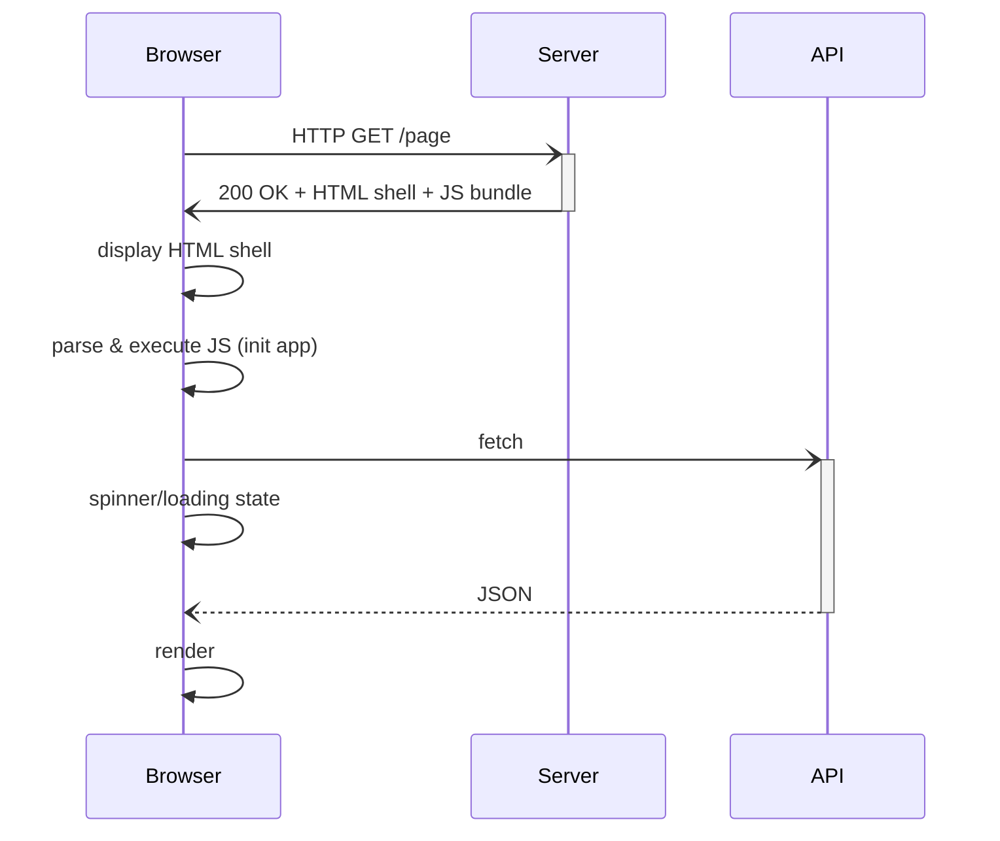
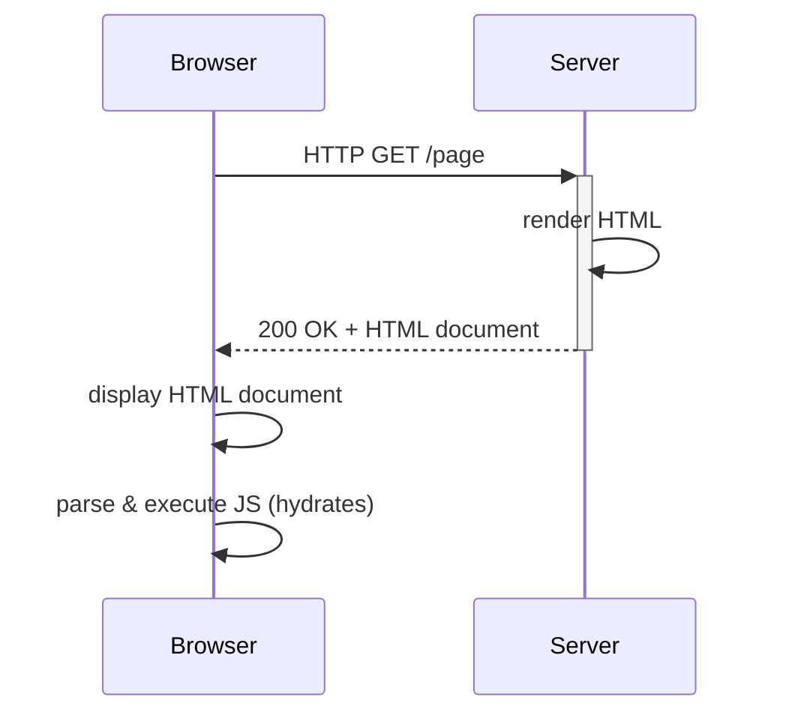
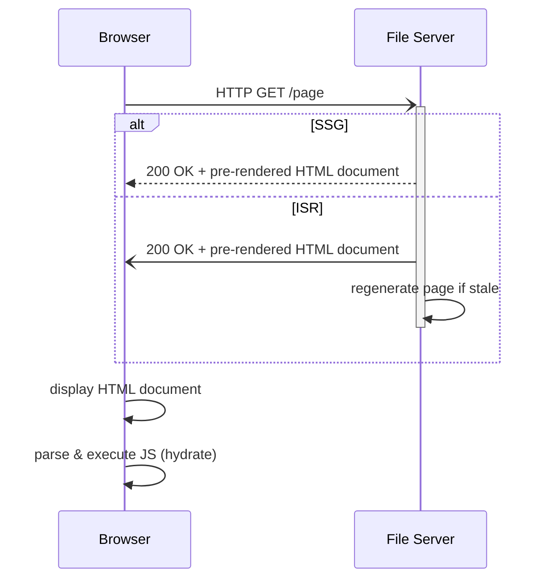

# Web Frameworks Intro & Comparison

[Days since last javascript framework](https://dayssincelastjsframework.com/)

## On comparing web frameworks


Number of frameworks make it impossible to compare them all\
so this workshop focuses on building a framework for comparing and deciding on them.

## Why do we need frameworks?

Vanilla web technologies have become very powerful with Fetch, ESM,\
and WebComponents providing many of the features frameworks have been used for.


But Vanilla JS and browser API's still lack some features which are\
common requirements for complex applications which frameworks provide:

- Reactivity & State Management
- Abstractions
  - Routing (URL -> Page -> Components)
  - Syntax
  - Namespacing components
  - Database connectors
- Tooling CLI scaffolding
  - Building/Bundling
  - Image/Resource optimisations
  - Environment Support (LSP, Typescript support, linting)
  - Testing

## How websites are rendered

For rendering and serving websites, generally web frameworks use one (or more) of:

**CSR** - Client-Side Rendering
: Browser gets HTML shell, JS builds the page

**SSR** - Server-Side Rendering
: Server builds full HTML, sends to browser which _hydrates_

**SSG** - Static Site Generation
: HTML built at build time, served as static files



### Client-Side Rendering

The server provides an API, the browser/client builds the pages



### Server-Side Rendering

The server generates and serves the pages on request



### Static Site Generator

The server generates the pages once, and as file server serves the pages



For SSG comparisons see [Jam Stack](https://jamstack.org/generators/).

### Pros & Cons

Many web frameworks are capable of using different rendering approaches for different routes

|         | pros                                                                   | cons                                                                                     |
| ------- | ---------------------------------------------------------------------- | ---------------------------------------------------------------------------------------- |
| **CSR** | &bull; dynamic & interactive<br>&bull; feels native (page transitions) | &bull; poor SEO (breaks without JS)<br>&bull; slow first load                            |
| **SSR** | &bull; SEO (works without JS)<br>&bull; fast perceived load            | &bull; higher server load<br>&bull; hydration delay<br>&bull; complexity with state sync |
| **SSG** | &bull; fastest (CDN-friendly)<br>&bull; simple & secure (no server)    | &bull; stale until rebuild<br>&bull; state-less                                          |

## Framework Landscape & Comparisons

Most _used_ frameworks:

- [Stack Overflow Survey](https://survey.stackoverflow.co/2025/technology#1-web-frameworks-and-technologies)
- [State of JS](https://2024.stateofjs.com/en-US/libraries/front-end-frameworks/#front_end_frameworks_work)

Most _admired_ frameworks:

- [Stack Overflow Survey](https://survey.stackoverflow.co/2025/technology#2-web-frameworks-and-technologies)
- [State of JS](https://2024.stateofjs.com/en-US/libraries/front-end-frameworks/#front_end_frameworks_ratios)

### State Management & Reactivity

Reactivity
: Automatic UI updates in response to dynamic state

Vanilla JS is not reactive:

```html
<button id="count"></button>
<span id="doubled"></span>
<script>
  let count = 0
  let doubled = count * 2
  const countElement = document.getElementById('count')
  const doubledElement = document.getElementById('doubled')
  countElement.textContent = count
  doubledElement.textContent = doubled

  countElement.addEventListener('click', () => {
    doubled = ++count * 2
  })
</script>
```

<example-counter data-broken="true" data-idx="1"></example-counter>

UI must be explicitly updated to match state:

```js
// ...
countElement.addEventListener('click', () => {
  doubled = ++count * 2

  countElement.textContent = count.toString()
  doubledElement.textContent = doubled.toString()
})
```

<example-counter data-broken="false" data-idx="2"></example-counter>

### Signals vs Virtual DOM

**Virtual DOM/Diffing:**

```jsx
// React
function Counter() {
  const [count, setCount] = useState(0)
  const doubled = count * 2

  return (
    <button onClick={() => setCount(count + 1)}>
      count: {count}, doubled: {doubled}
    </button>
  )
}
```

- setState triggers a re-render in the virtual DOM
- DOM and virtualDOM are diffed
- changes are updated

**Signals:**

```svelte
<script>
  // Svelte
  let count = $state(0);
  const doubled = $derived(count * 2)
</script>

<button onclick={() => count++}>
  count: {count}, doubled: {doubled}
</button>
```

- dependencies are registered with the signal
- when the signal updates dependencies are re-evaluated

[Compare Syntaxes for popular frontend libraries](https://component-party.dev/)

Signals have become the most popular approach for reactivity,
with many frameworks migrating from their old implementations to signals.

### Routers & Build tooling

Routing:

- File-based
  - Routes map to a directory of your source and follow its structure
  - [Astro example](https://docs.astro.build/en/guides/routing/#static-routes)
  - [Portfolio example](https://rainrain.io/blog/dynamic-routes/)

- Code based
  - Routes are programmed/configured
  - [Tanstack Router example](https://tanstack.com/router/latest)

Build tools:

- [Turbopack](https://nextjs.org/docs/app/api-reference/turbopack)/Webpack
  - Older
  - Slower
  - Uses code splitting
  - Used by React/Next.js

- [Vite](https://vite.dev/)/Rollup
  - Newer
  - Faster
  - ESM based
  - Used by modern frameworks, e.g., Svelte, Vue, Astro

Both Webpack and Vite can be extended with plugins,\
for [example](https://github.com/twicerain/rainrain.v4.0/blob/main/astro.config.mjs) to add image compression

## Outliers

- [HTMX](https://htmx.org/docs/#introduction)
  - Extends HTML with attributes (`hx-get`, `hx-swap`)
  - Works with document fragments over JSON
  - Lightweight, no build step, minimal JS
- [Astro](https://astro.build/) / [Fresh](https://fresh.deno.dev/)
  - [Islands](https://docs.astro.build/en/concepts/islands/) architecture
  - Meta framework (can be used with any other frontend framework)
  - Content focused
    - Sets up Zod for type checking of markdown files or CMS content
- [Phoenix](https://hexdocs.pm/phoenix/overview.html)
  - Most admired framework since 2023 on Stack Overflow Survey
  - Keeps state close to the source of truth
  - Full featured CLI that scaffolds using the MVC pattern
  - LiveView: Handles reactivity on the server over websockets with a minimal JS runtime
    - Feels like a SPA with no client-side state
- [Ripple](https://www.ripplejs.com/)
  - Adds component keyword
  - Written by former React engineer and current Svelte core maintainer

## Thanks

Discussion/questions
